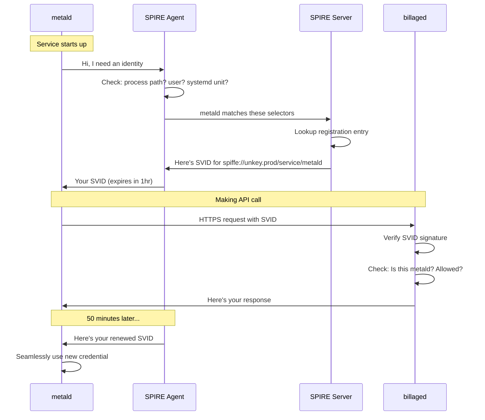

# Understanding SPIFFE/SPIRE: A Developer's Guide

## The Problem with Traditional PKI

Traditional certificate management is like managing physical keys:
- You create keys (generate certificates)
- You copy keys (distribute cert files)
- You worry about lost keys (compromised certs)
- You change locks periodically (rotate certificates)
- Someone forgets to change locks (cert expires in production)

## Enter SPIFFE: Identity for Services

SPIFFE (Secure Production Identity Framework For Everyone) reimagines service identity:
- Services have identities, not just certificates
- Identities are verified continuously, not just at creation
- Credentials rotate automatically, like changing passwords every hour
- No files to manage, everything happens in memory

## Core Concepts Explained

### SPIFFE ID: Your Service's Name Tag
```
spiffe://unkey.prod/service/metald
   │        │          │        │
   │        │          │        └── Specific service
   │        │          └────────── Category
   │        └────────────────────── Your trust domain  
   └────────────────────────────── Always starts with spiffe://
```

Think of it like an email address for services:
- `john@company.com` → `spiffe://company.com/user/john`
- `metald@unkey` → `spiffe://unkey.prod/service/metald`

### SVID: Your Service's ID Card

SVID (SPIFFE Verifiable Identity Document) is like an employee ID card:
- Contains the service's SPIFFE ID
- Cryptographically signed by company (SPIRE)
- Expires quickly (1 hour) for security
- Automatically renewed before expiry

### Workload: Any Running Process

In SPIFFE terms, a "workload" is just your running service:
- `metald` process = workload
- Docker container = workload  
- Kubernetes pod = workload
- Lambda function = workload

### Attestation: Proving Who You Are

Attestation is how SPIRE verifies a service's identity:

**Like a bouncer checking IDs:**
- "What's your process path?" → `/usr/bin/metald` ✓
- "What systemd unit?" → `metald.service` ✓
- "What user are you?" → `unkey-metald` ✓
- "Here's your SVID!" → 🎫

## How It Works: The Airport Security Analogy

1. **Check-In (Registration)**
   - You register services with SPIRE like checking in for a flight
   - "metald service runs at /usr/bin/metald as user unkey-metald"

2. **Security Check (Attestation)**
   - Service connects to SPIRE agent
   - Agent verifies the service matches registration
   - Like TSA checking your boarding pass matches your ID

3. **Boarding Pass (SVID)**
   - Service receives time-limited credential
   - Like a boarding pass that expires in 1 hour
   - Automatically renewed if you're still at the gate

4. **Flight (Service Communication)**
   - Services show their SVIDs to each other
   - Both verify the other's identity
   - Encrypted communication established

## Real-World Example: metald → billaged

### Traditional Way
```go
// metald code - OLD WAY
cert, _ := tls.LoadX509KeyPair("/etc/metald/cert.pem", "/etc/metald/key.pem")
client := &http.Client{
    Transport: &http.Transport{
        TLSClientConfig: &tls.Config{
            Certificates: []tls.Certificate{cert},
            RootCAs:      loadCA("/etc/metald/ca.pem"),
        },
    },
}
resp, _ := client.Get("https://billaged:8081/api/usage")
```

**Problems:**
- Where do cert files come from?
- Who rotates them?
- How does billaged know it's really metald?

### SPIFFE Way
```go
// metald code - NEW WAY
spiffeClient, _ := spiffe.New(ctx)
client := spiffeClient.HTTPClient()
resp, _ := client.Get("https://billaged:8081/api/usage")
```

**Benefits:**
- No certificate files
- Automatic rotation
- Strong identity verification

## The Magic: What Happens Behind the Scenes



## Why This Matters for Developers

### No More Certificate Nightmares
- ❌ "The cert expired and broke production"
- ❌ "Where do I put the cert files?"
- ❌ "How do I rotate certificates?"
- ✅ It just works™

### Better Security By Default
- Short-lived credentials (1 hour vs 1 year)
- Automatic rotation (no human errors)
- Strong workload identity (not just having a file)

### Simplified Operations
```bash
# Old way
1. Generate CA
2. Generate service certs  
3. Copy certs to servers
4. Configure services
5. Setup rotation scripts
6. Monitor expiry
7. Panic at 3am

# SPIFFE way
1. Deploy SPIRE
2. Register services
3. Done
```

## Common Questions

**Q: What if SPIRE server goes down?**
A: Services keep their current SVIDs until expiry (1hr). Deploy SPIRE in HA mode for production.

**Q: Can I still use regular TLS?**
A: Yes! Services can accept both SPIFFE and traditional certs during migration.

**Q: How is this different from service mesh?**
A: SPIFFE provides identity. Service meshes (Istio, Linkerd) often use SPIFFE underneath.

**Q: Do I need Kubernetes?**
A: No! SPIFFE works great with systemd services, containers, VMs, or bare metal.

## Debugging Tips

### Check if service has SVID
```bash
# As the service user
sudo -u unkey-metald spire-agent api fetch x509 \
  -socketPath /run/spire/sockets/agent.sock
```

### View SVID details
```bash
# See the actual certificate
sudo -u unkey-metald spire-agent api fetch x509 \
  -socketPath /run/spire/sockets/agent.sock \
  -write /tmp/svid.pem

openssl x509 -in /tmp/svid.pem -text -noout
```

### Monitor SVID rotation
```bash
# Watch SVIDs refresh
watch -n 10 'spire-agent api fetch x509 | grep "SPIFFE ID"'
```

## Further Learning

1. **Interactive Tutorial**: https://play.instruqt.com/spiffe
2. **Concepts Deep Dive**: https://spiffe.io/book/
3. **Production Guide**: https://spiffe.io/docs/latest/planning/production/
4. **Community Slack**: https://spiffe.slack.com

Remember: SPIFFE/SPIRE is just solving certificate management automatically. Your services still speak normal TLS - they just don't manage certificates anymore!