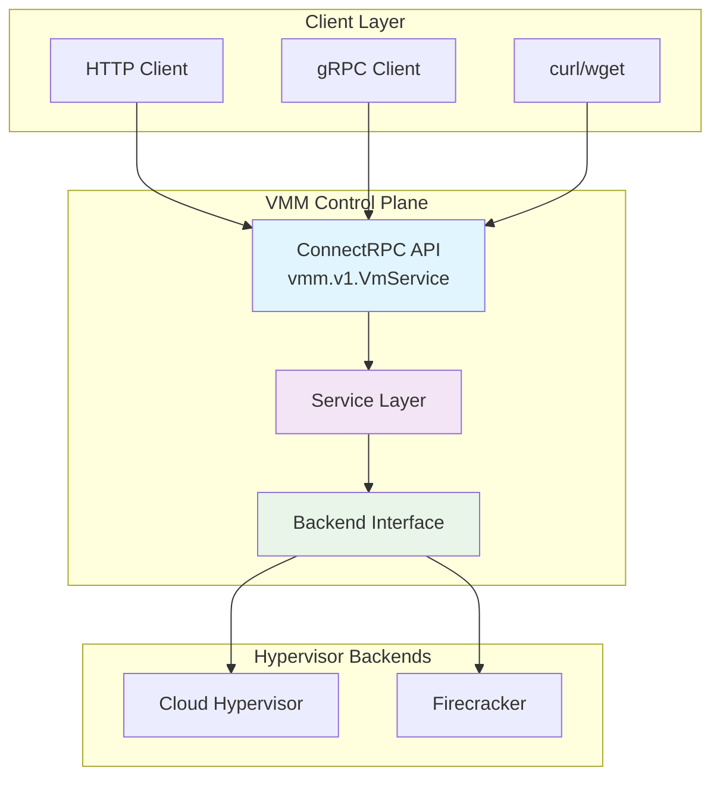

# VMM Control Plane API Reference

Complete API reference for the VMM Control Plane unified API. This API provides a single interface for managing virtual machines across multiple hypervisor backends.

## Overview

The VMM Control Plane exposes a ConnectRPC-based API that supports both gRPC and HTTP/1.1 protocols. The API is defined using Protocol Buffers and provides consistent behavior across Cloud Hypervisor and Firecracker backends.

### API Architecture



## Base Configuration

### Server Information

- **Base URL**: `http://localhost:8080` (default)
- **Protocol**: HTTP/1.1, HTTP/2, gRPC
- **Content-Type**: `application/json` (HTTP) or `application/grpc` (gRPC)

### Environment Variables

Configure the VMM Control Plane behavior:

| Variable | Default | Description |
|----------|---------|-------------|
| `UNKEY_VMCP_PORT` | `8080` | Server port |
| `UNKEY_VMCP_ADDRESS` | `0.0.0.0` | Bind address |
| `UNKEY_VMCP_BACKEND` | `cloudhypervisor` | Backend type |
| `UNKEY_VMCP_CH_ENDPOINT` | `unix:///tmp/ch.sock` | Cloud Hypervisor socket |
| `UNKEY_VMCP_FC_ENDPOINT` | `unix:///tmp/firecracker.sock` | Firecracker socket |

## Service Definition

### VmService

The main service interface for VM operations:

```protobuf
service VmService {
  // Create a new virtual machine
  rpc CreateVm(CreateVmRequest) returns (CreateVmResponse);

  // Delete a virtual machine
  rpc DeleteVm(DeleteVmRequest) returns (DeleteVmResponse);

  // Boot a created virtual machine
  rpc BootVm(BootVmRequest) returns (BootVmResponse);

  // Shutdown a running virtual machine
  rpc ShutdownVm(ShutdownVmRequest) returns (ShutdownVmResponse);

  // Pause a running virtual machine
  rpc PauseVm(PauseVmRequest) returns (PauseVmResponse);

  // Resume a paused virtual machine
  rpc ResumeVm(ResumeVmRequest) returns (ResumeVmResponse);

  // Reboot a running virtual machine
  rpc RebootVm(RebootVmRequest) returns (RebootVmResponse);

  // Get virtual machine information
  rpc GetVmInfo(GetVmInfoRequest) returns (GetVmInfoResponse);
}
```

## API Endpoints

### CreateVm

Create a new virtual machine with the specified configuration.

**Endpoint**: `POST /vmm.v1.VmService/CreateVm`

#### Request

```json
{
  "config": {
    "cpu": {
      "vcpu_count": 2,
      "max_vcpu_count": 4
    },
    "memory": {
      "size_bytes": 2147483648
    },
    "boot": {
      "kernel_path": "/opt/kernels/vmlinux",
      "initrd_path": "/opt/initrd/initramfs.img",
      "kernel_args": "console=ttyS0 root=/dev/vda1 rw"
    },
    "storage": [
      {
        "path": "/var/lib/vms/vm.img",
        "read_only": false,
        "is_root_device": true
      }
    ],
    "network": [
      {
        "id": "eth0",
        "tap_device": "vmtap0",
        "mac_address": "52:54:00:01:02:03"
      }
    ],
    "console": {
      "enabled": true,
      "output": "/var/log/vms/vm.log"
    }
  }
}
```

#### Response

```json
{
  "vm_id": "vm-1704067200-abc123"
}
```

#### Configuration Schema

##### CpuConfig

| Field | Type | Required | Description | Backend Support |
|-------|------|----------|-------------|-----------------|
| `vcpu_count` | int32 | Yes | Number of virtual CPUs | All |
| `max_vcpu_count` | int32 | No | Maximum vCPUs for hotplug | Cloud Hypervisor only |

##### MemoryConfig

| Field | Type | Required | Description | Backend Support |
|-------|------|----------|-------------|-----------------|
| `size_bytes` | int64 | Yes | Memory size in bytes | All |

##### BootConfig

| Field | Type | Required | Description | Backend Support |
|-------|------|----------|-------------|-----------------|
| `kernel_path` | string | Yes | Path to kernel image | All |
| `initrd_path` | string | No | Path to initrd image | All |
| `kernel_args` | string | No | Kernel command line | All |

##### StorageDevice

| Field | Type | Required | Description | Backend Support |
|-------|------|----------|-------------|-----------------|
| `path` | string | Yes | Disk image path | All |
| `read_only` | bool | No | Read-only mount | All |
| `is_root_device` | bool | No | Mark as root device | All |

##### NetworkInterface

| Field | Type | Required | Description | Backend Support |
|-------|------|----------|-------------|-----------------|
| `id` | string | Yes | Interface identifier | All |
| `tap_device` | string | Yes | TAP device name | All |
| `mac_address` | string | No | MAC address | All |

##### ConsoleConfig

| Field | Type | Required | Description | Backend Support |
|-------|------|----------|-------------|-----------------|
| `enabled` | bool | No | Enable console logging | All |
| `output` | string | No | Console output file | All |

#### Error Responses

- **400 Bad Request**: Invalid configuration
- **500 Internal Server Error**: Backend failure

### DeleteVm

Remove a virtual machine instance.

**Endpoint**: `POST /vmm.v1.VmService/DeleteVm`

#### Request

```json
{
  "vm_id": "vm-1704067200-abc123"
}
```

#### Response

```json
{
  "success": true
}
```

#### Error Responses

- **400 Bad Request**: Missing or invalid VM ID
- **404 Not Found**: VM not found
- **500 Internal Server Error**: Backend failure

### BootVm

Start a created virtual machine.

**Endpoint**: `POST /vmm.v1.VmService/BootVm`

#### Request

```json
{
  "vm_id": "vm-1704067200-abc123"
}
```

#### Response

```json
{
  "success": true
}
```

#### Error Responses

- **400 Bad Request**: Missing or invalid VM ID
- **404 Not Found**: VM not found
- **409 Conflict**: VM already running
- **500 Internal Server Error**: Backend failure

### ShutdownVm

Gracefully shutdown a running virtual machine.

**Endpoint**: `POST /vmm.v1.VmService/ShutdownVm`

#### Request

```json
{
  "vm_id": "vm-1704067200-abc123"
}
```

#### Response

```json
{
  "success": true
}
```

#### Error Responses

- **400 Bad Request**: Missing or invalid VM ID
- **404 Not Found**: VM not found
- **409 Conflict**: VM not running
- **500 Internal Server Error**: Backend failure

### PauseVm

Pause a running virtual machine.

**Endpoint**: `POST /vmm.v1.VmService/PauseVm`

#### Request

```json
{
  "vm_id": "vm-1704067200-abc123"
}
```

#### Response

```json
{
  "success": true
}
```

#### Error Responses

- **400 Bad Request**: Missing or invalid VM ID
- **404 Not Found**: VM not found
- **409 Conflict**: VM not running or already paused
- **500 Internal Server Error**: Backend failure

### ResumeVm

Resume a paused virtual machine.

**Endpoint**: `POST /vmm.v1.VmService/ResumeVm`

#### Request

```json
{
  "vm_id": "vm-1704067200-abc123"
}
```

#### Response

```json
{
  "success": true
}
```

#### Error Responses

- **400 Bad Request**: Missing or invalid VM ID
- **404 Not Found**: VM not found
- **409 Conflict**: VM not paused
- **500 Internal Server Error**: Backend failure

### RebootVm

Reboot a running virtual machine.

**Endpoint**: `POST /vmm.v1.VmService/RebootVm`

#### Request

```json
{
  "vm_id": "vm-1704067200-abc123"
}
```

#### Response

```json
{
  "success": true
}
```

#### Error Responses

- **400 Bad Request**: Missing or invalid VM ID
- **404 Not Found**: VM not found
- **409 Conflict**: VM not running
- **500 Internal Server Error**: Backend failure

### GetVmInfo

Retrieve information about a virtual machine.

**Endpoint**: `POST /vmm.v1.VmService/GetVmInfo`

#### Request

```json
{
  "vm_id": "vm-1704067200-abc123"
}
```

#### Response

```json
{
  "config": {
    "cpu": {
      "vcpu_count": 2,
      "max_vcpu_count": 4
    },
    "memory": {
      "size_bytes": 2147483648
    },
    "boot": {
      "kernel_path": "/opt/kernels/vmlinux",
      "kernel_args": "console=ttyS0 root=/dev/vda1 rw"
    },
    "storage": [
      {
        "path": "/var/lib/vms/vm.img",
        "read_only": false,
        "is_root_device": true
      }
    ]
  },
  "state": "VM_STATE_RUNNING"
}
```

#### VM States

| State | Description |
|-------|-------------|
| `VM_STATE_UNSPECIFIED` | Unknown state |
| `VM_STATE_CREATED` | VM created but not started |
| `VM_STATE_RUNNING` | VM is running |
| `VM_STATE_SHUTDOWN` | VM is shutdown |
| `VM_STATE_PAUSED` | VM is paused |

#### Error Responses

- **400 Bad Request**: Missing or invalid VM ID
- **404 Not Found**: VM not found
- **500 Internal Server Error**: Backend failure

## Health Endpoint

Check the health and status of the VMM Control Plane.

**Endpoint**: `GET /_/health`

### Response

```json
{
  "status": "healthy",
  "backend": "cloudhypervisor",
  "uptime_seconds": 3600,
  "version": "dev"
}
```

## Complete Examples

### Complete VM Lifecycle with Cloud Hypervisor

```bash
# Set backend to Cloud Hypervisor
export UNKEY_VMCP_BACKEND=cloudhypervisor

# Create VM
VM_ID=$(curl -s -X POST http://localhost:8080/vmm.v1.VmService/CreateVm \
  -H "Content-Type: application/json" \
  -d '{
    "config": {
      "cpu": {"vcpu_count": 2, "max_vcpu_count": 4},
      "memory": {"size_bytes": 2147483648},
      "boot": {
        "kernel_path": "/opt/kernels/vmlinux",
        "kernel_args": "console=ttyS0 root=/dev/vda1"
      },
      "storage": [{
        "path": "/var/lib/vms/dev.img",
        "is_root_device": true
      }]
    }
  }' | jq -r '.vm_id')

echo "Created VM: $VM_ID"

# Boot VM
curl -X POST http://localhost:8080/vmm.v1.VmService/BootVm \
  -H "Content-Type: application/json" \
  -d "{\"vm_id\": \"$VM_ID\"}"

# Check VM status
curl -X POST http://localhost:8080/vmm.v1.VmService/GetVmInfo \
  -H "Content-Type: application/json" \
  -d "{\"vm_id\": \"$VM_ID\"}" | jq

# Pause VM
curl -X POST http://localhost:8080/vmm.v1.VmService/PauseVm \
  -H "Content-Type: application/json" \
  -d "{\"vm_id\": \"$VM_ID\"}"

# Resume VM
curl -X POST http://localhost:8080/vmm.v1.VmService/ResumeVm \
  -H "Content-Type: application/json" \
  -d "{\"vm_id\": \"$VM_ID\"}"

# Shutdown VM
curl -X POST http://localhost:8080/vmm.v1.VmService/ShutdownVm \
  -H "Content-Type: application/json" \
  -d "{\"vm_id\": \"$VM_ID\"}"

# Delete VM
curl -X POST http://localhost:8080/vmm.v1.VmService/DeleteVm \
  -H "Content-Type: application/json" \
  -d "{\"vm_id\": \"$VM_ID\"}"
```

### Serverless Function with Firecracker

```bash
# Set backend to Firecracker
export UNKEY_VMCP_BACKEND=firecracker

# Create lightweight serverless VM
VM_ID=$(curl -s -X POST http://localhost:8080/vmm.v1.VmService/CreateVm \
  -H "Content-Type: application/json" \
  -d '{
    "config": {
      "cpu": {"vcpu_count": 1},
      "memory": {"size_bytes": 536870912},
      "boot": {
        "kernel_path": "/opt/kernels/serverless-kernel",
        "kernel_args": "console=ttyS0 root=/dev/vda1 init=/lambda/bootstrap quiet"
      },
      "storage": [{
        "path": "/var/lib/functions/nodejs-runtime.ext4",
        "read_only": true,
        "is_root_device": true
      }]
    }
  }' | jq -r '.vm_id')

echo "Created Serverless VM: $VM_ID"

# Boot VM (should be very fast with Firecracker)
time curl -X POST http://localhost:8080/vmm.v1.VmService/BootVm \
  -H "Content-Type: application/json" \
  -d "{\"vm_id\": \"$VM_ID\"}"

# Function executes...

# Cleanup
curl -X POST http://localhost:8080/vmm.v1.VmService/ShutdownVm \
  -H "Content-Type: application/json" \
  -d "{\"vm_id\": \"$VM_ID\"}"

curl -X POST http://localhost:8080/vmm.v1.VmService/DeleteVm \
  -H "Content-Type: application/json" \
  -d "{\"vm_id\": \"$VM_ID\"}"
```

## gRPC Usage

### Go Client Example

```go
package main

import (
    "context"
    "log"

    "connectrpc.com/connect"
    vmmv1 "vmm-controlplane/gen/vmm/v1"
    "vmm-controlplane/gen/vmm/v1/vmmv1connect"
)

func main() {
    client := vmmv1connect.NewVmServiceClient(
        http.DefaultClient,
        "http://localhost:8080",
    )

    // Create VM
    req := &vmmv1.CreateVmRequest{
        Config: &vmmv1.VmConfig{
            Cpu: &vmmv1.CpuConfig{
                VcpuCount: 2,
            },
            Memory: &vmmv1.MemoryConfig{
                SizeBytes: 2 * 1024 * 1024 * 1024, // 2GB
            },
            Boot: &vmmv1.BootConfig{
                KernelPath: "/opt/kernels/vmlinux",
                KernelArgs: "console=ttyS0 root=/dev/vda1",
            },
            Storage: []*vmmv1.StorageDevice{
                {
                    Path: "/var/lib/vms/test.img",
                    IsRootDevice: true,
                },
            },
        },
    }

    resp, err := client.CreateVm(context.Background(), connect.NewRequest(req))
    if err != nil {
        log.Fatal(err)
    }

    log.Printf("Created VM: %s", resp.Msg.VmId)
}
```

### Python Client Example

```python
import requests
import json

# Create VM configuration
config = {
    "config": {
        "cpu": {"vcpu_count": 2},
        "memory": {"size_bytes": 2147483648},
        "boot": {
            "kernel_path": "/opt/kernels/vmlinux",
            "kernel_args": "console=ttyS0 root=/dev/vda1"
        },
        "storage": [{
            "path": "/var/lib/vms/python-test.img",
            "is_root_device": True
        }]
    }
}

# Create VM
response = requests.post(
    "http://localhost:8080/vmm.v1.VmService/CreateVm",
    headers={"Content-Type": "application/json"},
    json=config
)

vm_id = response.json()["vm_id"]
print(f"Created VM: {vm_id}")

# Boot VM
requests.post(
    "http://localhost:8080/vmm.v1.VmService/BootVm",
    headers={"Content-Type": "application/json"},
    json={"vm_id": vm_id}
)

print("VM booted successfully")
```

## Error Handling

### Standard Error Response

```json
{
  "code": "invalid_argument",
  "message": "memory size_bytes must be greater than 0",
  "details": [
    {
      "type": "field_violation",
      "field": "config.memory.size_bytes",
      "description": "Value must be positive"
    }
  ]
}
```

### Common Error Codes

| Code | HTTP Status | Description |
|------|-------------|-------------|
| `invalid_argument` | 400 | Request validation failed |
| `not_found` | 404 | VM not found |
| `already_exists` | 409 | VM already exists |
| `failed_precondition` | 409 | Invalid state transition |
| `internal` | 500 | Backend error |
| `unavailable` | 503 | Backend unavailable |

## Rate Limiting

The API currently does not implement rate limiting. For production deployments, consider implementing rate limiting at the load balancer or API gateway level. <- :thinking: anyone know a company that does this??

## Authentication

The API currently does not implement authentication. For production deployments, implement authentication at the API gateway or reverse proxy level.

## Observability

### OpenTelemetry Integration

The VMM Control Plane includes comprehensive OpenTelemetry instrumentation:

- **Traces**: Request tracing through the entire call stack
- **Metrics**: Request counters, latency histograms, error rates
- **Logs**: Structured logging with correlation IDs

Configure via environment variables:

```bash
export UNKEY_VMCP_OTEL_ENABLED=true
export UNKEY_VMCP_OTEL_SERVICE_NAME=vmm-controlplane
export UNKEY_VMCP_OTEL_ENDPOINT=http://jaeger:14268/api/traces
```

### Prometheus Metrics

Available at `http://localhost:9464/metrics` when enabled:

- `vmm_requests_total`: Total API requests
- `vmm_request_duration_seconds`: Request latency
- `vmm_backend_operations_total`: Backend operation counts
- `vmm_vms_active`: Currently active VMs

## API Versioning

The API uses semantic versioning with the version embedded in the protobuf package:

- Current version: `vmm.v1`
- Breaking changes will increment the major version (e.g., `vmm.v2`)
- Backward-compatible changes maintain the same version

## See Also

- [VM Configuration Guide](deploy-vm-instance-configuration.md)
- [Backend Support Matrix](backend-support.md)
- [Migration Guide](migration-guide.md)
- [VMM Control Plane Glossary](glossary.md)
