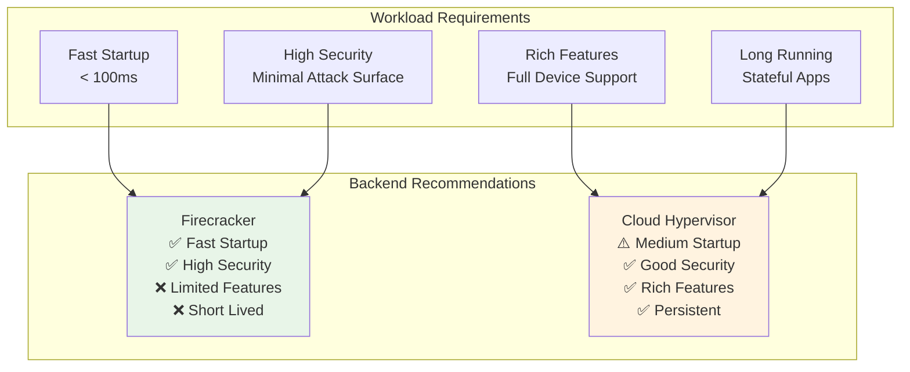
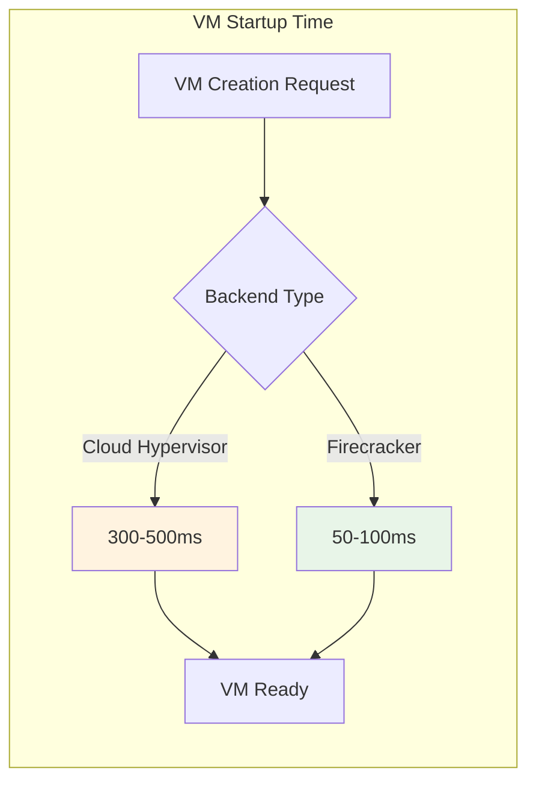
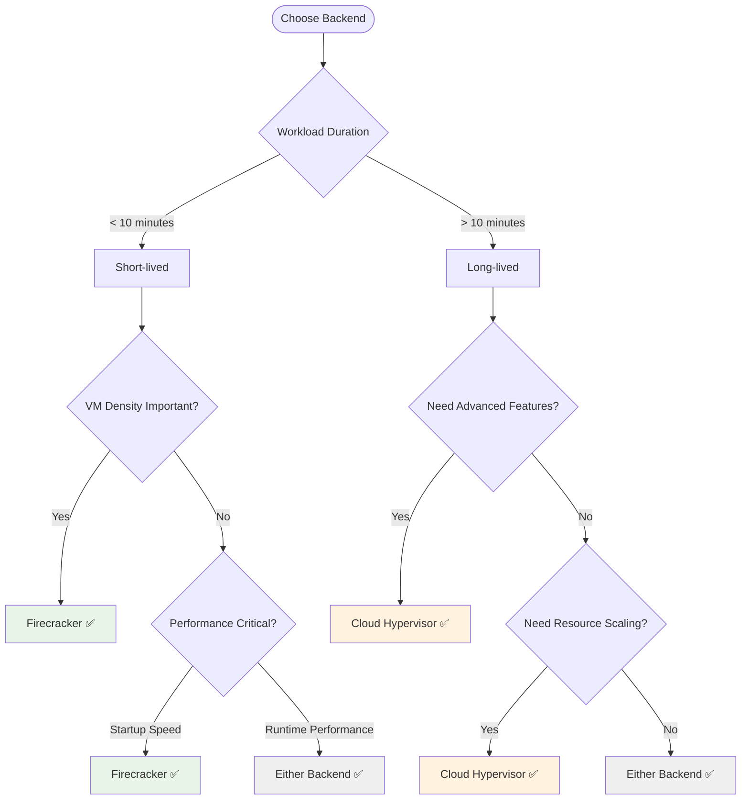

# VMM Backend Support Matrix

This document provides a comprehensive comparison of hypervisor backend capabilities supported by the VMM Control Plane, helping you choose the right backend for your workload.

## Overview

The VMM Control Plane supports multiple hypervisor backends through a unified API. Each backend has different strengths, capabilities, and target use cases.



## Feature Comparison Matrix

### Core VM Operations

| Feature | Cloud Hypervisor | Firecracker | Notes |
|---------|------------------|-------------|-------|
| **VM Creation** | ✅ Full Support | ✅ Full Support | Both support all unified API fields |
| **VM Boot** | ✅ Full Support | ✅ Full Support | Firecracker ~5x faster startup |
| **VM Shutdown** | ✅ Graceful | ⚠️ Force Only | Firecracker uses Ctrl+Alt+Del |
| **VM Pause/Resume** | ✅ Full Support | ✅ Full Support | Both support pause/resume |
| **VM Reboot** | ✅ Full Support | ⚠️ Force Only | Firecracker uses Ctrl+Alt+Del |
| **VM Delete** | ✅ Full Support | ✅ Full Support | Resource cleanup |

### CPU Features

| Feature | Cloud Hypervisor | Firecracker | Details |
|---------|------------------|-------------|---------|
| **vCPU Count** | ✅ 1-448 vCPUs | ✅ 1-32 vCPUs | CH supports higher density |
| **CPU Hotplug** | ✅ Supported | ❌ Not Supported | Runtime vCPU scaling |
| **max_vcpu_count** | ✅ Honored | ❌ Ignored | Hotplug preparation |
| **CPU Topology** | ✅ Advanced | ❌ Basic | NUMA, sockets, cores |
| **CPU Affinity** | ✅ Supported | ❌ Not Supported | Pin vCPUs to physical cores |

### Memory Features

| Feature | Cloud Hypervisor | Firecracker | Details |
|---------|------------------|-------------|---------|
| **Memory Size** | ✅ 512MB - 1TB+ | ✅ 128MB - 32GB | CH supports larger VMs |
| **Memory Hotplug** | ✅ Supported | ❌ Not Supported | Runtime memory scaling |
| **Hugepages** | ✅ 2MB/1GB | ❌ Not Supported | Better performance for large workloads |
| **NUMA** | ✅ Full Support | ❌ Not Supported | Multi-socket optimization |
| **Memory Sharing** | ✅ Supported | ❌ Not Supported | KSM, shared memory |

### Storage Features

| Feature | Cloud Hypervisor | Firecracker | Details |
|---------|------------------|-------------|---------|
| **Block Devices** | ✅ Files + Raw | ✅ Files + Raw | Both support file and block devices |
| **Read-only Disks** | ✅ Supported | ✅ Supported | Immutable storage |
| **Multiple Disks** | ✅ Unlimited | ✅ ~10 Devices | CH supports more storage devices |
| **Disk Hotplug** | ✅ Supported | ❌ Not Supported | Runtime disk addition |
| **Advanced I/O** | ✅ Full Support | ⚠️ Basic | io_uring, rate limiting, etc. |

### Network Features

| Feature | Cloud Hypervisor | Firecracker | Details |
|---------|------------------|-------------|---------|
| **TAP Interfaces** | ✅ Multiple | ✅ Single/Few | CH supports more network interfaces |
| **MAC Addresses** | ✅ Custom | ✅ Custom | Both support custom MAC assignment |
| **vhost-user** | ✅ Supported | ❌ Not Supported | High-performance networking |
| **Network Hotplug** | ✅ Supported | ❌ Not Supported | Runtime network changes |
| **SR-IOV** | ✅ Supported | ❌ Not Supported | Hardware acceleration |

### Console & Debugging

| Feature | Cloud Hypervisor | Firecracker | Details |
|---------|------------------|-------------|---------|
| **Serial Console** | ✅ Full Support | ✅ Full Support | Both support console output |
| **Console Logging** | ✅ File Output | ✅ File Output | Log console to files |
| **Debug Features** | ✅ Rich | ⚠️ Minimal | CH has more debugging capabilities |
| **GDB Support** | ✅ Supported | ⚠️ Limited | Kernel debugging |

## Performance Characteristics

### Startup Performance



| Metric | Cloud Hypervisor | Firecracker | Advantage |
|---------|------------------|-------------|-----------|
| **Cold Start** | 300-500ms | 50-100ms | Firecracker 5-10x faster |
| **Memory Footprint** | 50-100MB | 5-15MB | Firecracker 3-10x smaller |
| **Boot to Init** | ~1-2 seconds | ~200-500ms | Firecracker 2-4x faster |
| **Process Creation** | Medium | Ultra-fast | Firecracker optimized |

### Runtime Performance

| Metric | Cloud Hypervisor | Firecracker | Notes |
|---------|------------------|-------------|-------|
| **CPU Performance** | ✅ Excellent | ✅ Excellent | Both near-native |
| **Memory Performance** | ✅ Excellent | ✅ Excellent | Both use KVM |
| **I/O Performance** | ✅ Full Features | ⚠️ Basic | CH has more optimization options |
| **Network Performance** | ✅ High | ✅ Good | CH supports more acceleration |

### Density & Scaling

| Metric | Cloud Hypervisor | Firecracker | Winner |
|---------|------------------|-------------|--------|
| **VMs per Host** | 50-200 | 1000+ | Firecracker |
| **Memory Efficiency** | Good | Excellent | Firecracker |
| **CPU Efficiency** | Good | Excellent | Firecracker |
| **Startup Concurrency** | Medium | High | Firecracker |

## Use Case Recommendations

### ✅ Cloud Hypervisor - Best For

#### Production Workloads
```json
{
  "use_cases": [
    "Long-running applications",
    "Database servers",
    "Web application servers",
    "Development environments",
    "Complex multi-tier applications"
  ],
  "advantages": [
    "Full device support",
    "CPU/Memory hotplug",
    "Advanced networking",
    "Rich debugging features",
    "Production stability"
  ]
}
```

#### Example Configuration
```json
{
  "config": {
    "cpu": {"vcpu_count": 8, "max_vcpu_count": 16},
    "memory": {"size_bytes": 17179869184},
    "storage": [
      {"path": "/dev/nvme0n1", "is_root_device": true},
      {"path": "/dev/nvme1n1", "is_root_device": false}
    ],
    "network": [
      {"id": "mgmt", "tap_device": "br-mgmt"},
      {"id": "data", "tap_device": "br-data"}
    ]
  }
}
```

### ✅ Firecracker - Best For

#### Serverless & Microservices
```json
{
  "use_cases": [
    "Function-as-a-Service (FaaS)",
    "Serverless containers",
    "CI/CD runners",
    "Short-lived workloads",
    "Multi-tenant isolation"
  ],
  "advantages": [
    "Ultra-fast startup",
    "Minimal memory footprint",
    "High security isolation",
    "High VM density",
    "Cost efficiency"
  ]
}
```

#### Example Configuration
```json
{
  "config": {
    "cpu": {"vcpu_count": 1},
    "memory": {"size_bytes": 536870912},
    "boot": {
      "kernel_path": "/opt/kernels/minimal",
      "kernel_args": "console=ttyS0 init=/lambda/bootstrap quiet"
    },
    "storage": [{
      "path": "/var/lib/functions/runtime.ext4",
      "read_only": true,
      "is_root_device": true
    }]
  }
}
```

## Backend Selection Guide

### Decision Matrix



### Selection Criteria

| Criteria | Cloud Hypervisor | Firecracker | Decision Factor |
|----------|------------------|-------------|-----------------|
| **Startup Speed** | ⚠️ Medium | ✅ Ultra-fast | < 100ms requirement → Firecracker |
| **Feature Richness** | ✅ Complete | ⚠️ Minimal | Advanced features → Cloud Hypervisor |
| **Resource Scaling** | ✅ Hotplug | ❌ Static | Dynamic scaling → Cloud Hypervisor |
| **VM Density** | ⚠️ Medium | ✅ High | > 100 VMs/host → Firecracker |
| **Security** | ✅ Good | ✅ Excellent | Minimal attack surface → Firecracker |
| **Debugging** | ✅ Rich | ⚠️ Basic | Complex debugging → Cloud Hypervisor |

## Migration Between Backends

### Configuration Compatibility

Most VM configurations are compatible between backends, but some fields behave differently:

#### Ignored Fields in Firecracker
```json
{
  "cpu": {
    "max_vcpu_count": "ignored - no hotplug support"
  }
}
```

#### Enhanced Fields in Cloud Hypervisor
```json
{
  "cpu": {
    "max_vcpu_count": "used for hotplug preparation"
  },
  "memory": {
    "size_bytes": "supports larger allocations"
  }
}
```

### Runtime Migration

VMs cannot be migrated between backends at runtime. To switch backends:

1. Create new VM with desired backend
2. Migrate application data
3. Switch traffic to new VM
4. Decommission old VM

## Monitoring & Observability

### Backend-Specific Metrics

#### Cloud Hypervisor Metrics
- VM resource utilization
- Hotplug operations
- Device statistics
- NUMA topology usage

#### Firecracker Metrics
- Startup latency distribution
- VM density per host
- Memory efficiency
- Security event counters

### Health Checks

Both backends support health checking via the unified API:

```bash
# Check overall health
curl http://localhost:8080/_/health

# Response includes backend type
{
  "status": "healthy",
  "backend": "firecracker",
  "uptime_seconds": 3600
}
```

## Configuration Examples by Use Case

### Web Application (Cloud Hypervisor)

```json
{
  "config": {
    "cpu": {"vcpu_count": 4, "max_vcpu_count": 8},
    "memory": {"size_bytes": 8589934592},
    "boot": {
      "kernel_path": "/opt/kernels/web-optimized",
      "kernel_args": "console=ttyS0 root=/dev/vda1"
    },
    "storage": [
      {"path": "/var/lib/vms/web-app.img", "is_root_device": true},
      {"path": "/var/lib/vms/web-data.img", "is_root_device": false}
    ],
    "network": [
      {"id": "public", "tap_device": "br-public"},
      {"id": "private", "tap_device": "br-private"}
    ]
  }
}
```

### Lambda Function (Firecracker)

```json
{
  "config": {
    "cpu": {"vcpu_count": 1},
    "memory": {"size_bytes": 268435456},
    "boot": {
      "kernel_path": "/opt/kernels/lambda",
      "kernel_args": "console=ttyS0 init=/lambda/init quiet"
    },
    "storage": [{
      "path": "/var/lib/lambda/nodejs-runtime.ext4",
      "read_only": true,
      "is_root_device": true
    }]
  }
}
```

### Database Server (Cloud Hypervisor)

```json
{
  "config": {
    "cpu": {"vcpu_count": 16, "max_vcpu_count": 32},
    "memory": {"size_bytes": 68719476736},
    "boot": {
      "kernel_path": "/opt/kernels/db-optimized",
      "kernel_args": "console=ttyS0 root=/dev/vda1 transparent_hugepage=never"
    },
    "storage": [
      {"path": "/var/lib/vms/db-system.img", "is_root_device": true},
      {"path": "/dev/nvme1n1", "is_root_device": false},
      {"path": "/dev/nvme2n1", "is_root_device": false}
    ],
    "network": [{
      "id": "db-cluster",
      "tap_device": "br-cluster",
      "mac_address": "52:54:00:db:01:01"
    }]
  }
}
```

### CI/CD Runner (Firecracker)

```json
{
  "config": {
    "cpu": {"vcpu_count": 2},
    "memory": {"size_bytes": 2147483648},
    "boot": {
      "kernel_path": "/opt/kernels/ci-runner",
      "kernel_args": "console=ttyS0 root=/dev/vda1 init=/ci/bootstrap"
    },
    "storage": [{
      "path": "/var/lib/ci/runner-base.img",
      "read_only": true,
      "is_root_device": true
    }]
  }
}
```

## Troubleshooting by Backend

### Cloud Hypervisor Issues

| Issue | Symptom | Solution |
|-------|---------|----------|
| **Slow Startup** | > 1 second boot | Optimize kernel, use smaller initrd |
| **High Memory Usage** | > 100MB overhead | Normal for feature-rich hypervisor |
| **Hotplug Failures** | Resource addition fails | Check max_vcpu_count configuration |
| **Network Issues** | Multiple NICs fail | Verify bridge configurations |

### Firecracker Issues

| Issue | Symptom | Solution |
|-------|---------|----------|
| **Feature Not Working** | API call ignored | Check feature compatibility matrix |
| **Startup Failures** | Boot hangs | Use minimal kernel, avoid complex drivers |
| **Memory Constraints** | OOM kills | Optimize memory usage, smaller runtimes |
| **Limited Debugging** | Hard to troubleshoot | Use console logging, structured logging |

## Future Roadmap

### Planned Enhancements

#### Cloud Hypervisor
- GPU passthrough support
- Advanced NUMA topology
- Live migration capabilities
- Enhanced debugging tools

#### Firecracker
- Improved debugging support
- Additional device types
- Enhanced networking options
- Smaller memory footprint

#### Unified API
- Additional backend support (QEMU, other hypervisors)
- Enhanced configuration options
- Better observability integration
- Performance optimizations

## See Also

- [VM Configuration Guide](deploy-vm-instance-configuration.md)
- [API Reference](api-reference.md)
- [Migration Guide](migration-guide.md)
- [VMM Control Plane Glossary](glossary.md)
