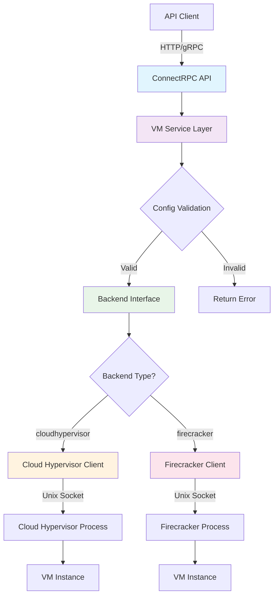
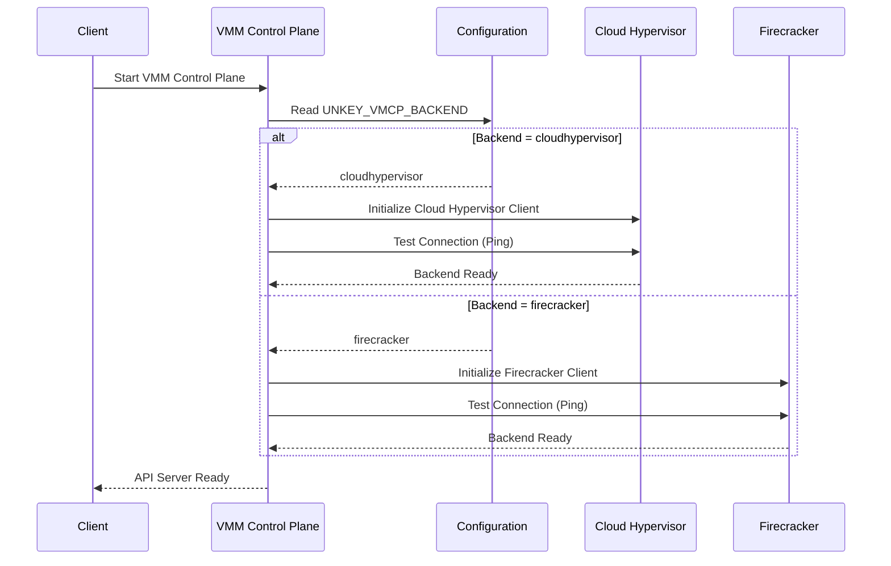
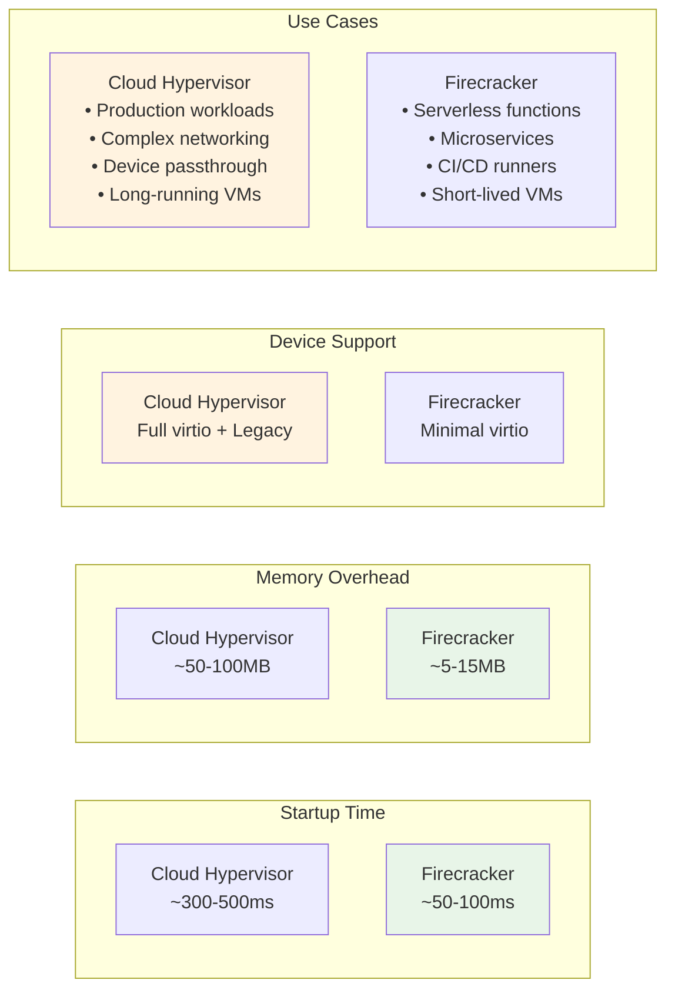
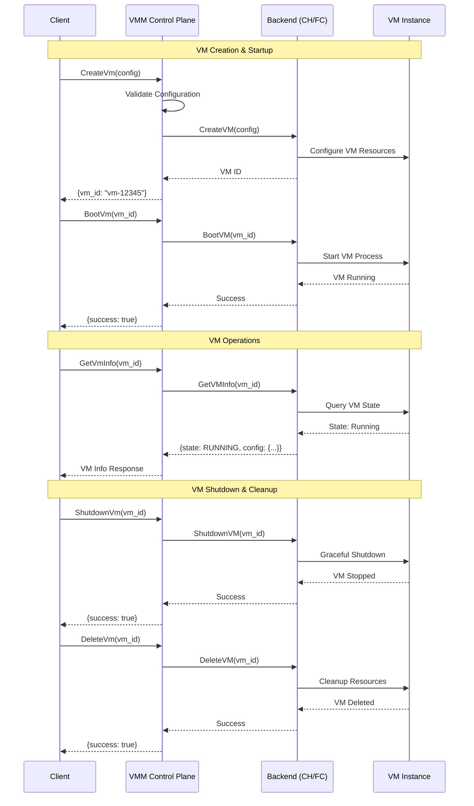

# VMM Control Plane VM Configuration Guide

This document outlines how to create and configure virtual machines using the VMM Control Plane's unified API. The control plane provides a single API that works with multiple hypervisor backends including Cloud Hypervisor and Firecracker.

## Overview

The VMM Control Plane (VMCP) abstracts VM creation through a unified protobuf API, allowing you to create VMs using different hypervisor backends without changing your configuration format. The backend type is selected through environment variables, not in the VM configuration itself.

## Architecture

```
┌─────────────────────────────────────────────┐
│             ConnectRPC API                  │  ← Unified VMM API
├─────────────────────────────────────────────┤
│            Service Layer                    │  ← Validation & orchestration
├─────────────────────────────────────────────┤
│           Backend Interface                 │  ← Abstract VM operations
├─────────────────────────────────────────────┤
│    Cloud Hypervisor  │    Firecracker      │  ← Hypervisor implementations
└─────────────────────────────────────────────┘
```

### Request Flow Architecture



### Backend Selection Flow



## Backend Selection

The hypervisor backend is configured via environment variables:

```bash
# Use Cloud Hypervisor backend (default)
export UNKEY_VMCP_BACKEND=cloudhypervisor
export UNKEY_VMCP_CH_ENDPOINT=unix:///tmp/ch.sock

# Use Firecracker backend  
export UNKEY_VMCP_BACKEND=firecracker
export UNKEY_VMCP_FC_ENDPOINT=unix:///tmp/firecracker.sock
```

## Unified VM Configuration

All VM configurations use the same protobuf structure regardless of backend:

### Basic VM Configuration

The minimal configuration required for any VM:

```json
{
  "config": {
    "cpu": {
      "vcpu_count": 2,
      "max_vcpu_count": 4
    },
    "memory": {
      "size_bytes": 2147483648
    },
    "boot": {
      "kernel_path": "/opt/kernels/vmlinux",
      "kernel_args": "console=ttyS0 root=/dev/vda1 rw"
    },
    "storage": [
      {
        "path": "/var/lib/vms/ubuntu-22.04.img",
        "read_only": false,
        "is_root_device": true
      }
    ]
  }
}
```

### Advanced VM Configuration

More comprehensive configuration with networking and console:

```json
{
  "config": {
    "cpu": {
      "vcpu_count": 8,
      "max_vcpu_count": 16
    },
    "memory": {
      "size_bytes": 8589934592
    },
    "boot": {
      "kernel_path": "/opt/kernels/vmlinux-5.15",
      "initrd_path": "/opt/initrd/initramfs-5.15.img", 
      "kernel_args": "console=ttyS0 root=/dev/vda1 rw quiet"
    },
    "storage": [
      {
        "path": "/var/lib/vms/system.img",
        "read_only": false,
        "is_root_device": true
      },
      {
        "path": "/var/lib/vms/data.img", 
        "read_only": false,
        "is_root_device": false
      }
    ],
    "network": [
      {
        "id": "eth0",
        "tap_device": "vmtap0",
        "mac_address": "52:54:00:01:02:03"
      }
    ],
    "console": {
      "enabled": true,
      "output": "/var/log/vms/vm-console.log"
    }
  }
}
```

### Production VM Configuration

Enterprise-ready configuration with multiple resources:

```json
{
  "config": {
    "cpu": {
      "vcpu_count": 16,
      "max_vcpu_count": 32
    },
    "memory": {
      "size_bytes": 34359738368
    },
    "boot": {
      "kernel_path": "/opt/kernels/production-kernel",
      "initrd_path": "/opt/initrd/production-initrd.img",
      "kernel_args": "console=ttyS0 root=/dev/vda1 rw transparent_hugepage=never"
    },
    "storage": [
      {
        "path": "/dev/nvme0n1p1",
        "read_only": false,
        "is_root_device": true
      },
      {
        "path": "/dev/nvme1n1",
        "read_only": false,
        "is_root_device": false
      },
      {
        "path": "/var/lib/vms/shared-data.img",
        "read_only": true,
        "is_root_device": false
      }
    ],
    "network": [
      {
        "id": "mgmt",
        "tap_device": "vmtap-mgmt",
        "mac_address": "52:54:00:01:02:10"
      },
      {
        "id": "data", 
        "tap_device": "vmtap-data",
        "mac_address": "52:54:00:01:02:20"
      }
    ],
    "console": {
      "enabled": true,
      "output": "/var/log/vms/prod-vm.log"
    }
  }
}
```

## Configuration Fields Reference

### CPU Configuration (`cpu`)

| Field | Type | Required | Description | Backend Support |
|-------|------|----------|-------------|-----------------|
| `vcpu_count` | int32 | Yes | Number of virtual CPUs at boot | All |
| `max_vcpu_count` | int32 | No | Maximum vCPUs (for hotplug) | Cloud Hypervisor |

### Memory Configuration (`memory`)

| Field | Type | Required | Description | Backend Support |
|-------|------|----------|-------------|-----------------|
| `size_bytes` | int64 | Yes | Memory size in bytes | All |

### Boot Configuration (`boot`) 

| Field | Type | Required | Description | Backend Support |
|-------|------|----------|-------------|-----------------|
| `kernel_path` | string | Yes | Path to kernel image | All |
| `initrd_path` | string | No | Path to initrd image | All |
| `kernel_args` | string | No | Kernel command line arguments | All |

### Storage Configuration (`storage[]`)

| Field | Type | Required | Description | Backend Support |
|-------|------|----------|-------------|-----------------|
| `path` | string | Yes | Path to disk image or block device | All |
| `read_only` | bool | No | Mount as read-only (default: false) | All |
| `is_root_device` | bool | No | Mark as root device (default: false) | All |

### Network Configuration (`network[]`)

| Field | Type | Required | Description | Backend Support |
|-------|------|----------|-------------|-----------------|
| `id` | string | Yes | Interface identifier | All |
| `tap_device` | string | Yes | TAP device name on host | All |
| `mac_address` | string | No | MAC address (auto-generated if empty) | All |

### Console Configuration (`console`)

| Field | Type | Required | Description | Backend Support |
|-------|------|----------|-------------|-----------------|
| `enabled` | bool | No | Enable console output (default: false) | All |
| `output` | string | No | File path for console output | All |

## Backend-Specific Behavior

### Performance Characteristics



### Cloud Hypervisor Backend

**Advantages:**
- Supports CPU hotplug (`max_vcpu_count`)
- Rich device emulation
- Production-ready stability
- Advanced NUMA and CPU topology
- Full Linux compatibility
- Device passthrough support

**Configuration Notes:**
- Supports all configuration fields
- Block devices can be files or raw devices
- Network interfaces support advanced features
- Excellent for long-running, complex workloads

### Firecracker Backend

**Advantages:**
- Ultra-fast startup times (<100ms)
- Minimal attack surface
- Optimal for serverless workloads
- Lower memory overhead
- High density deployments
- Security-first design

**Configuration Notes:**
- `max_vcpu_count` is ignored (no CPU hotplug)
- Optimized for simple, stateless workloads
- Limited device emulation for security
- Perfect for function-as-a-service platforms

## Complete API Examples

### Creating a VM (ConnectRPC)

```bash
# Create development VM with Cloud Hypervisor
export UNKEY_VMCP_BACKEND=cloudhypervisor
curl -X POST http://localhost:8080/vmm.v1.VmService/CreateVm \
  -H "Content-Type: application/json" \
  -d '{
    "config": {
      "cpu": {"vcpu_count": 2},
      "memory": {"size_bytes": 2147483648},
      "boot": {
        "kernel_path": "/opt/kernels/vmlinux",
        "kernel_args": "console=ttyS0 root=/dev/vda1"
      },
      "storage": [{
        "path": "/var/lib/vms/dev.img",
        "is_root_device": true
      }]
    }
  }'

# Create serverless VM with Firecracker  
export UNKEY_VMCP_BACKEND=firecracker
curl -X POST http://localhost:8080/vmm.v1.VmService/CreateVm \
  -H "Content-Type: application/json" \
  -d '{
    "config": {
      "cpu": {"vcpu_count": 1},
      "memory": {"size_bytes": 1073741824},
      "boot": {
        "kernel_path": "/opt/kernels/serverless-kernel",
        "kernel_args": "console=ttyS0 root=/dev/vda1 init=/app/bootstrap"
      },
      "storage": [{
        "path": "/var/lib/functions/runtime.img",
        "is_root_device": true
      }]
    }
  }'
```

### VM Lifecycle Management



#### Lifecycle Commands

```bash
# Boot the VM
curl -X POST http://localhost:8080/vmm.v1.VmService/BootVm \
  -H "Content-Type: application/json" \
  -d '{"vm_id": "vm-12345"}'

# Get VM information
curl -X POST http://localhost:8080/vmm.v1.VmService/GetVmInfo \
  -H "Content-Type: application/json" \
  -d '{"vm_id": "vm-12345"}'

# Shutdown VM
curl -X POST http://localhost:8080/vmm.v1.VmService/ShutdownVm \
  -H "Content-Type: application/json" \
  -d '{"vm_id": "vm-12345"}'

# Delete VM  
curl -X POST http://localhost:8080/vmm.v1.VmService/DeleteVm \
  -H "Content-Type: application/json" \
  -d '{"vm_id": "vm-12345"}'
```

## Use Case Patterns

### Development Environment

```json
{
  "config": {
    "cpu": {"vcpu_count": 2},
    "memory": {"size_bytes": 4294967296},
    "boot": {
      "kernel_path": "/opt/kernels/dev-kernel",
      "kernel_args": "console=ttyS0 root=/dev/vda1 rw debug"
    },
    "storage": [{
      "path": "/var/lib/vms/dev-ubuntu.img",
      "is_root_device": true
    }],
    "console": {"enabled": true}
  }
}
```

### Serverless Function Runtime

```json
{
  "config": {
    "cpu": {"vcpu_count": 1},
    "memory": {"size_bytes": 536870912},
    "boot": {
      "kernel_path": "/opt/kernels/minimal-kernel",
      "kernel_args": "console=ttyS0 root=/dev/vda1 init=/lambda/bootstrap quiet"
    },
    "storage": [{
      "path": "/var/lib/functions/runtime.ext4",
      "read_only": true,
      "is_root_device": true
    }]
  }
}
```

### Database Server

```json
{
  "config": {
    "cpu": {"vcpu_count": 8, "max_vcpu_count": 16},
    "memory": {"size_bytes": 17179869184},
    "boot": {
      "kernel_path": "/opt/kernels/db-optimized",
      "kernel_args": "console=ttyS0 root=/dev/vda1 transparent_hugepage=never"
    },
    "storage": [
      {
        "path": "/var/lib/vms/db-system.img", 
        "is_root_device": true
      },
      {
        "path": "/dev/nvme1n1",
        "is_root_device": false
      }
    ],
    "network": [{
      "id": "db-net",
      "tap_device": "db-tap0",
      "mac_address": "52:54:00:db:01:01"
    }]
  }
}
```

## Performance Considerations

### Cloud Hypervisor Optimization

- Use `max_vcpu_count` for applications that may need CPU scaling
- Configure multiple network interfaces for traffic separation
- Use block devices instead of files for production storage

### Firecracker Optimization  

- Keep memory allocation minimal for faster startup
- Use read-only root filesystems when possible
- Minimize kernel size and disable unnecessary features
- Single network interface is usually sufficient

## Security Best Practices

1. **Isolation**: Use separate storage for different security domains
2. **Read-only**: Make system images read-only when possible  
3. **Network Segmentation**: Use multiple network interfaces for different traffic types
4. **Minimal Kernels**: Remove unnecessary kernel features to reduce attack surface
5. **Console Logging**: Enable console logging for debugging and auditing

## Troubleshooting

### Common Configuration Errors

1. **Invalid memory size**: Must be at least 512MB (536870912 bytes)
2. **Missing kernel**: Ensure `kernel_path` points to a valid kernel image
3. **Storage path**: Verify storage paths exist and are accessible
4. **TAP device**: Ensure TAP devices are created before VM creation
5. **Backend mismatch**: Verify the correct backend is selected via environment variables

### Debugging

```bash
# Check backend health
curl http://localhost:8080/_/health

# View console output (if enabled)
tail -f /var/log/vms/vm-console.log

# Check VM status
curl -X POST http://localhost:8080/vmm.v1.VmService/GetVmInfo \
  -H "Content-Type: application/json" \
  -d '{"vm_id": "your-vm-id"}'
```

## Migration from Legacy APIs

If migrating from Cloud Hypervisor-specific APIs, see `migration-guide.md` for detailed conversion instructions and breaking changes.