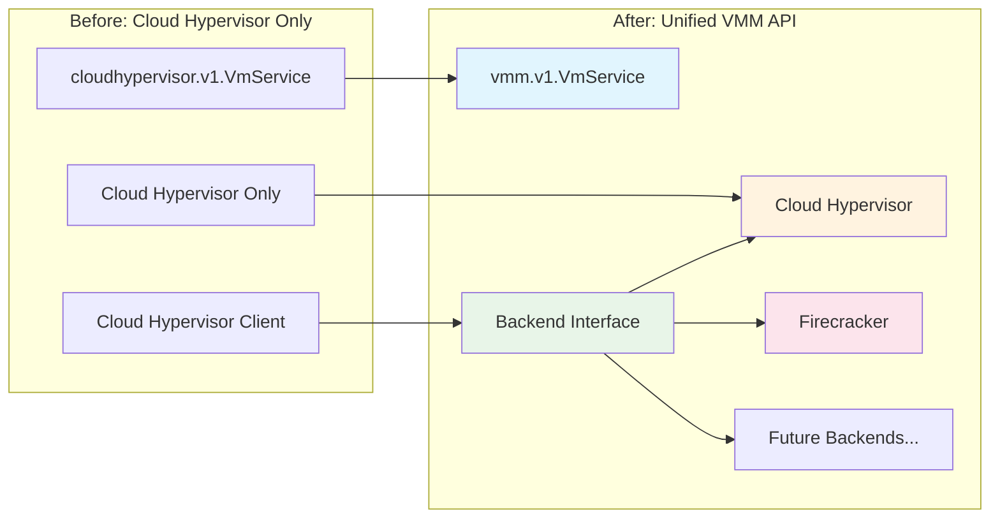

# VMM Control Plane Migration Guide

This guide helps users migrate from Cloud Hypervisor-specific APIs to the unified VMM Control Plane API that supports multiple hypervisor backends.

## Overview

The VMM Control Plane has evolved from a Cloud Hypervisor-specific control plane to a unified API that supports multiple hypervisor backends including Cloud Hypervisor and Firecracker. This migration maintains backward compatibility while enabling future hypervisor support.

### What Changed



## Breaking Changes

### 1. API Namespace Change

**Before:**
```protobuf
package cloudhypervisor.v1;
service VmService { ... }
```

**After:**
```protobuf
package vmm.v1;
service VmService { ... }
```

### 2. Import Path Updates

**Before:**
```go
import (
    cloudhypervisorv1 "vmm-controlplane/gen/cloudhypervisor/v1"
    "vmm-controlplane/gen/cloudhypervisor/v1/cloudhypervisorv1connect"
)
```

**After:**
```go
import (
    vmmv1 "vmm-controlplane/gen/vmm/v1"
    "vmm-controlplane/gen/vmm/v1/vmmv1connect"
)
```

### 3. Environment Variable Changes

**Before:**
```bash
export CHCP_PORT=8080
export CHCP_ADDRESS=0.0.0.0
export CHCP_CH_ENDPOINT=unix:///tmp/ch.sock
```

**After:**
```bash
export UNKEY_VMCP_PORT=8080
export UNKEY_VMCP_ADDRESS=0.0.0.0
export UNKEY_VMCP_BACKEND=cloudhypervisor  # New: backend selection
export UNKEY_VMCP_CH_ENDPOINT=unix:///tmp/ch.sock
export UNKEY_VMCP_FC_ENDPOINT=unix:///tmp/firecracker.sock  # New: Firecracker support
```

### 4. Service Name Updates

**Before:**
```bash
curl http://localhost:8080/cloudhypervisor.v1.VmService/CreateVm
```

**After:**
```bash
curl http://localhost:8080/vmm.v1.VmService/CreateVm
```

## Step-by-Step Migration

### Step 1: Update Dependencies

If using Go modules, update your imports:

```go
// Replace all instances of:
import cloudhypervisorv1 "vmm-controlplane/gen/cloudhypervisor/v1"
import "vmm-controlplane/gen/cloudhypervisor/v1/cloudhypervisorv1connect"

// With:
import vmmv1 "vmm-controlplane/gen/vmm/v1"
import "vmm-controlplane/gen/vmm/v1/vmmv1connect"
```

### Step 2: Update Client Code

**Before:**
```go
client := cloudhypervisorv1connect.NewVmServiceClient(
    http.DefaultClient,
    "http://localhost:8080",
)

req := &cloudhypervisorv1.CreateVmRequest{
    Config: &cloudhypervisorv1.VmConfig{
        // configuration
    },
}
```

**After:**
```go
client := vmmv1connect.NewVmServiceClient(
    http.DefaultClient,
    "http://localhost:8080",
)

req := &vmmv1.CreateVmRequest{
    Config: &vmmv1.VmConfig{
        // same configuration format
    },
}
```

### Step 3: Update API Endpoints

**Before:**
```bash
POST /cloudhypervisor.v1.VmService/CreateVm
POST /cloudhypervisor.v1.VmService/DeleteVm
POST /cloudhypervisor.v1.VmService/BootVm
# ... other endpoints
```

**After:**
```bash
POST /vmm.v1.VmService/CreateVm
POST /vmm.v1.VmService/DeleteVm
POST /vmm.v1.VmService/BootVm
# ... same endpoint structure, different namespace
```

### Step 4: Update Environment Variables

**Before:**
```bash
# Cloud Hypervisor Control Plane (CHCP) variables
export CHCP_PORT=8080
export CHCP_ADDRESS=0.0.0.0
export CHCP_CH_ENDPOINT=unix:///tmp/ch.sock
```

**After:**
```bash
# VMM Control Plane (VMCP) variables with UNKEY_ prefix
export UNKEY_VMCP_PORT=8080
export UNKEY_VMCP_ADDRESS=0.0.0.0
export UNKEY_VMCP_BACKEND=cloudhypervisor  # Select Cloud Hypervisor backend
export UNKEY_VMCP_CH_ENDPOINT=unix:///tmp/ch.sock
```

### Step 5: Update Configuration Format

The VM configuration format remains **exactly the same** - no changes needed:

```json
{
  "config": {
    "cpu": {"vcpu_count": 2, "max_vcpu_count": 4},
    "memory": {"size_bytes": 2147483648},
    "boot": {
      "kernel_path": "/opt/kernels/vmlinux",
      "kernel_args": "console=ttyS0 root=/dev/vda1"
    },
    "storage": [{
      "path": "/var/lib/vms/vm.img",
      "is_root_device": true
    }]
  }
}
```

## Migration Examples

### HTTP Client Migration

**Before:**
```bash
# Old Cloud Hypervisor API
curl -X POST http://localhost:8080/cloudhypervisor.v1.VmService/CreateVm \
  -H "Content-Type: application/json" \
  -d '{
    "config": {
      "cpu": {"vcpu_count": 2},
      "memory": {"size_bytes": 2147483648},
      "boot": {"kernel_path": "/opt/kernels/vmlinux"}
    }
  }'
```

**After:**
```bash
# New unified VMM API (Cloud Hypervisor backend)
export UNKEY_VMCP_BACKEND=cloudhypervisor
curl -X POST http://localhost:8080/vmm.v1.VmService/CreateVm \
  -H "Content-Type: application/json" \
  -d '{
    "config": {
      "cpu": {"vcpu_count": 2},
      "memory": {"size_bytes": 2147483648},
      "boot": {"kernel_path": "/opt/kernels/vmlinux"}
    }
  }'
```

### Go Client Migration

**Before:**
```go
package main

import (
    "context"
    "net/http"

    "connectrpc.com/connect"
    cloudhypervisorv1 "vmm-controlplane/gen/cloudhypervisor/v1"
    "vmm-controlplane/gen/cloudhypervisor/v1/cloudhypervisorv1connect"
)

func createVM() {
    client := cloudhypervisorv1connect.NewVmServiceClient(
        http.DefaultClient,
        "http://localhost:8080",
    )

    req := &cloudhypervisorv1.CreateVmRequest{
        Config: &cloudhypervisorv1.VmConfig{
            Cpu: &cloudhypervisorv1.CpuConfig{
                VcpuCount: 2,
            },
            Memory: &cloudhypervisorv1.MemoryConfig{
                SizeBytes: 2 * 1024 * 1024 * 1024,
            },
        },
    }

    resp, err := client.CreateVm(context.Background(), connect.NewRequest(req))
    // handle response
}
```

**After:**
```go
package main

import (
    "context"
    "net/http"

    "connectrpc.com/connect"
    vmmv1 "vmm-controlplane/gen/vmm/v1"  // Updated import
    "vmm-controlplane/gen/vmm/v1/vmmv1connect"  // Updated import
)

func createVM() {
    client := vmmv1connect.NewVmServiceClient(  // Updated client
        http.DefaultClient,
        "http://localhost:8080",
    )

    req := &vmmv1.CreateVmRequest{  // Updated type
        Config: &vmmv1.VmConfig{   // Updated type
            Cpu: &vmmv1.CpuConfig{ // Updated type
                VcpuCount: 2,
            },
            Memory: &vmmv1.MemoryConfig{ // Updated type
                SizeBytes: 2 * 1024 * 1024 * 1024,
            },
        },
    }

    resp, err := client.CreateVm(context.Background(), connect.NewRequest(req))
    // handle response - same as before
}
```

### Python Client Migration

**Before:**
```python
import requests

# Old API
response = requests.post(
    "http://localhost:8080/cloudhypervisor.v1.VmService/CreateVm",
    json={
        "config": {
            "cpu": {"vcpu_count": 2},
            "memory": {"size_bytes": 2147483648}
        }
    }
)
```

**After:**
```python
import requests
import os

# Set backend (optional, defaults to cloudhypervisor)
os.environ["UNKEY_VMCP_BACKEND"] = "cloudhypervisor"

# New unified API
response = requests.post(
    "http://localhost:8080/vmm.v1.VmService/CreateVm",  # Updated endpoint
    json={
        "config": {
            "cpu": {"vcpu_count": 2},
            "memory": {"size_bytes": 2147483648}
        }
    }
)
```

## Configuration Migration

### Environment Variables Reference

| Old Variable (CHCP) | New Variable (VMCP) | Description |
|---------------------|---------------------|-------------|
| `CHCP_PORT` | `UNKEY_VMCP_PORT` | Server port |
| `CHCP_ADDRESS` | `UNKEY_VMCP_ADDRESS` | Bind address |
| `CHCP_CH_ENDPOINT` | `UNKEY_VMCP_CH_ENDPOINT` | Cloud Hypervisor socket |
| N/A | `UNKEY_VMCP_BACKEND` | Backend type selection |
| N/A | `UNKEY_VMCP_FC_ENDPOINT` | Firecracker socket |

### Backend Selection

The biggest change is the addition of backend selection. Set the backend type via environment variable:

```bash
# Use Cloud Hypervisor (maintains existing behavior)
export UNKEY_VMCP_BACKEND=cloudhypervisor

# Use Firecracker (new capability)
export UNKEY_VMCP_BACKEND=firecracker
```

## New Features Available

### Multi-Backend Support

With the unified API, you can now switch between backends without changing your application code:

```bash
# Development with Cloud Hypervisor
export UNKEY_VMCP_BACKEND=cloudhypervisor
./vmm-controlplane

# Production serverless with Firecracker
export UNKEY_VMCP_BACKEND=firecracker
./vmm-controlplane
```

### Enhanced Configuration Options

The unified config supports backend-specific optimizations:

```json
{
  "config": {
    "cpu": {
      "vcpu_count": 2,
      "max_vcpu_count": 4  // Used by Cloud Hypervisor, ignored by Firecracker
    },
    "memory": {"size_bytes": 2147483648},
    "boot": {
      "kernel_path": "/opt/kernels/vmlinux",
      "kernel_args": "console=ttyS0 root=/dev/vda1"
    }
  }
}
```

### Improved Health Endpoint

The health endpoint now shows backend information:

**Before:**
```json
{"status": "healthy", "uptime_seconds": 3600}
```

**After:**
```json
{
  "status": "healthy",
  "backend": "cloudhypervisor",
  "uptime_seconds": 3600,
  "version": "dev"
}
```

## Compatibility Matrix

### API Compatibility

| Feature | Old API | New API | Status |
|---------|---------|---------|--------|
| VM Creation | ✅ | ✅ | **Fully Compatible** |
| VM Deletion | ✅ | ✅ | **Fully Compatible** |
| VM Boot/Shutdown | ✅ | ✅ | **Fully Compatible** |
| VM Pause/Resume | ✅ | ✅ | **Fully Compatible** |
| VM Info | ✅ | ✅ | **Fully Compatible** |
| Configuration Format | ✅ | ✅ | **Fully Compatible** |

### Response Format Compatibility

| Field | Old API | New API | Changes |
|-------|---------|---------|---------|
| `vm_id` | ✅ | ✅ | No change |
| `success` | ✅ | ✅ | No change |
| `config` | ✅ | ✅ | No change |
| `state` | ✅ | ✅ | No change |
| Error format | ✅ | ✅ | No change |

## Automated Migration Script

Use this script to migrate environment variables:

```bash
#!/bin/bash
# migrate-env.sh

echo "Migrating VMM Control Plane environment variables..."

# Create backup
env | grep "CHCP_" > chcp-backup.env

# Migrate variables
if [ ! -z "$CHCP_PORT" ]; then
    export UNKEY_VMCP_PORT="$CHCP_PORT"
    echo "Migrated CHCP_PORT -> UNKEY_VMCP_PORT"
fi

if [ ! -z "$CHCP_ADDRESS" ]; then
    export UNKEY_VMCP_ADDRESS="$CHCP_ADDRESS"
    echo "Migrated CHCP_ADDRESS -> UNKEY_VMCP_ADDRESS"
fi

if [ ! -z "$CHCP_CH_ENDPOINT" ]; then
    export UNKEY_VMCP_CH_ENDPOINT="$CHCP_CH_ENDPOINT"
    echo "Migrated CHCP_CH_ENDPOINT -> UNKEY_VMCP_CH_ENDPOINT"
fi

# Set default backend to maintain compatibility
export UNKEY_VMCP_BACKEND=cloudhypervisor
echo "Set UNKEY_VMCP_BACKEND=cloudhypervisor for compatibility"

echo "Migration complete. New variables:"
env | grep "UNKEY_VMCP_"
```

## Testing Migration

### 1. Verify API Compatibility

```bash
# Test old configuration with new API
export UNKEY_VMCP_BACKEND=cloudhypervisor

# Create VM using same config as before
curl -X POST http://localhost:8080/vmm.v1.VmService/CreateVm \
  -H "Content-Type: application/json" \
  -d @your-old-vm-config.json

# Should work identically to the old API
```

### 2. Test Backend Switching

```bash
# Test Cloud Hypervisor backend
export UNKEY_VMCP_BACKEND=cloudhypervisor
curl http://localhost:8080/_/health

# Test Firecracker backend (if available)
export UNKEY_VMCP_BACKEND=firecracker
curl http://localhost:8080/_/health
```

### 3. Integration Tests

```bash
# Test full VM lifecycle with new API
./scripts/test-vm-lifecycle.sh --backend cloudhypervisor
./scripts/test-vm-lifecycle.sh --backend firecracker
```

## Troubleshooting Migration

### Common Issues

#### 1. Import Not Found

**Error:**
```
cannot find package "vmm-controlplane/gen/cloudhypervisor/v1"
```

**Solution:**
Update imports to use the new unified API:
```go
// Change from:
import cloudhypervisorv1 "vmm-controlplane/gen/cloudhypervisor/v1"

// To:
import vmmv1 "vmm-controlplane/gen/vmm/v1"
```

#### 2. Endpoint Not Found

**Error:**
```
404 Not Found: /cloudhypervisor.v1.VmService/CreateVm
```

**Solution:**
Update endpoint URLs:
```bash
# Change from:
curl http://localhost:8080/cloudhypervisor.v1.VmService/CreateVm

# To:
curl http://localhost:8080/vmm.v1.VmService/CreateVm
```

#### 3. Environment Variables Not Working

**Error:**
```
failed to load config: missing required environment variables
```

**Solution:**
Use the new `UNKEY_VMCP_` prefix:
```bash
# Old
export CHCP_PORT=8080

# New
export UNKEY_VMCP_PORT=8080
```

#### 4. Backend Not Available

**Error:**
```
unsupported backend type: your-backend
```

**Solution:**
Use a supported backend:
```bash
export UNKEY_VMCP_BACKEND=cloudhypervisor  # or firecracker
```

## Migration Checklist

- [ ] Update import statements to use `vmm.v1` namespace
- [ ] Update client creation to use `vmmv1connect.NewVmServiceClient`
- [ ] Update API endpoint URLs from `cloudhypervisor.v1` to `vmm.v1`
- [ ] Migrate environment variables from `CHCP_` to `UNKEY_VMCP_` prefix
- [ ] Set `UNKEY_VMCP_BACKEND=cloudhypervisor` for Cloud Hypervisor compatibility
- [ ] Test VM creation and lifecycle operations
- [ ] Verify health endpoint responds with backend information
- [ ] Update deployment scripts and documentation
- [ ] Test integration with existing monitoring and logging
- [ ] Validate error handling works as expected

## Support and Resources

### Documentation

- [VM Configuration Guide](deploy-vm-instance-configuration.md) - Updated for unified API
- [API Reference](api-reference.md) - Complete endpoint documentation
- [Backend Support Matrix](backend-support.md) - Backend comparison and selection
- [VMM Control Plane Glossary](glossary.md) - Updated terminology

### Getting Help

1. **GitHub Issues**: Report migration issues or bugs
2. **Configuration Problems**: Check the troubleshooting section above
3. **Performance Questions**: See the backend support matrix
4. **Feature Requests**: Use GitHub discussions for feedback

The migration preserves all existing functionality while enabling new multi-backend capabilities. Your existing VM configurations and workflows will continue to work unchanged when using the Cloud Hypervisor backend.
