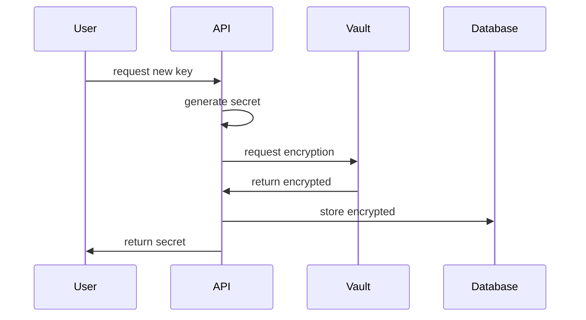

import { Accordion, Accordions } from "fumadocs-ui/components/accordion"

Vault is our encryption management service. It handles the full lifecycle of encrytion keys and allows you to encrypt and decrypt secrets. It does not store the secrets themselves.

Vault compiles to a single binary that can be run inside a container and requires an s3 compatible storage backend to store data.

## Features

- **Encryption**: Encrypt and decrypt secrets
- **Key Management**: Supports multiple keyrings, key rolling and secret re-encryption.
- **HTTP API**: Exposes an HTTP API via buf connect to interact with the service.

## Flow

## Q/A
### Why does vault not store secrets?

Putting all of your secrets alongside with the encryption keys opens up a security risk. If an attacker gains access to the system, they can easily decrypt all of the secrets. By separating the encryption keys from the secrets, we can ensure that even if the attacker gains access to one system, they still can't do anything.

- Encrypted secrets are stored in our main database.
- Encryption keys are encrypted and stored by vault.
- Only vault can decrypt the encryption keys and never hands out encryption keys to the outside world.

<Accordions>
  <Accordion title="Scenario 1: Main database is leaked">
    An attacker can see the encrypted secrets, but they can't decrypt them.
  </Accordion>

  <Accordion title="Scenario 2: Vault database is leaked">
    An attacker can see the encrypted encryption-keys, but they can't decrypt them
  </Accordion>
  <Accordion title="Scenario 3: Vault database and master keys are leaked">
    If vault's database is compromised, it's not unlikely they also have access to the master key, used to decrypt the encryption-keys. In this case, the attacker may decrypt the encryption-keys, but still does not have access to the ciphertexts, as they are stored in the
    main database.
  </Accordion>
</Accordions>

### Why a container and not cloudflare workers?

This once again comes down to caching
